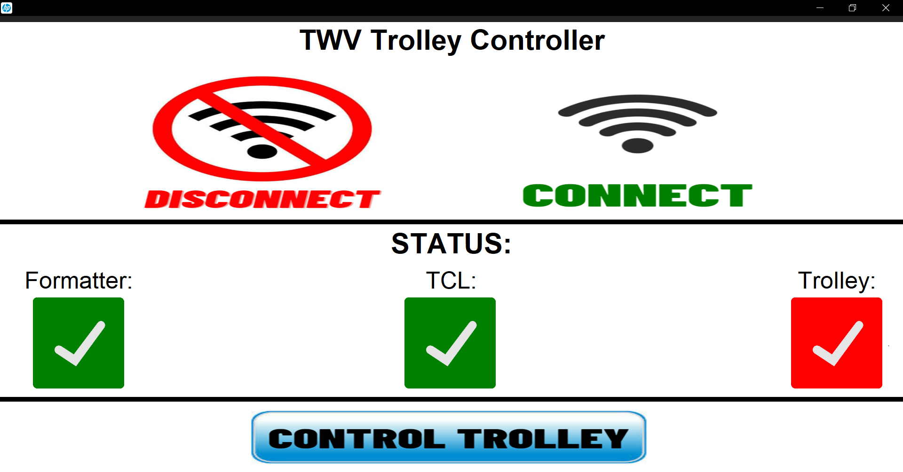
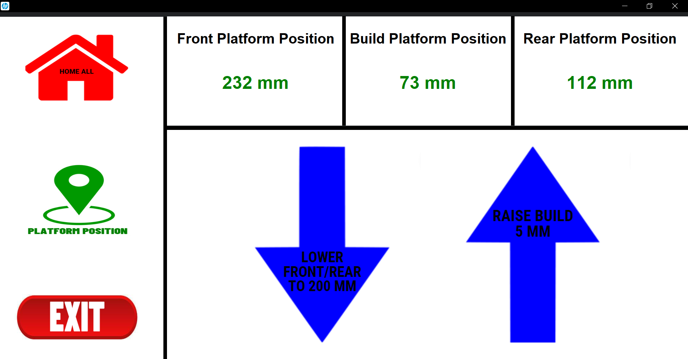
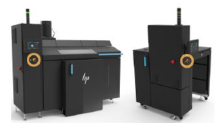
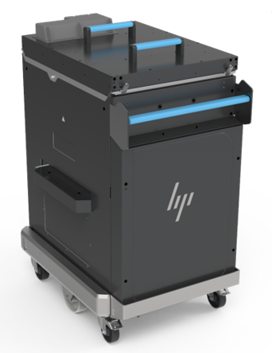

# Custom TrolleyController GUI

# 3D Metal Jet Printer(Twelve printer)

# Build Unit(Trolley)

# Overview
This is an interactive software application that uses Python and TCL commands to control HP’s 3D metal jet printer's build units. This GUI was designed to avoid having to connect the build unit to a metal jet printer. The operators no longer need a metal jet printer to lower or raise the build unit with this GUI.
'CustomTkinter' is what I used to make the GUI and I used "pyserial" to control the build units.
# Learn more about CustomTkinter
"CustomTkinter is a python UI-library based on Tkinter, which provides new, modern and fully customizable widgets. They are created and used like normal Tkinter widgets and can also be used in combination with normal Tkinter elements. The widgets and the window colors either adapt to the system appearance or the manually set mode ('light', 'dark'), and all CustomTkinter widgets and windows support HighDPI scaling (Windows, macOS). With CustomTkinter you'll get a consistent and modern look across all desktop platforms (Windows, macOS, Linux)" - TomSchimansky
- https://github.com/TomSchimansky/CustomTkinter
# Learn more about pyserial
"This module encapsulates the access for the serial port. It provides backends for Python running on Windows, OSX, Linux, BSD (possibly any POSIX compliant system) and IronPython. The module named "serial" automatically selects the appropriate backend" - pyserial
- https://github.com/pyserial/pyserial
# IMPORTANT INFORMATION
https://github.com/cesar-quevedo/trolleycontroller/wiki
